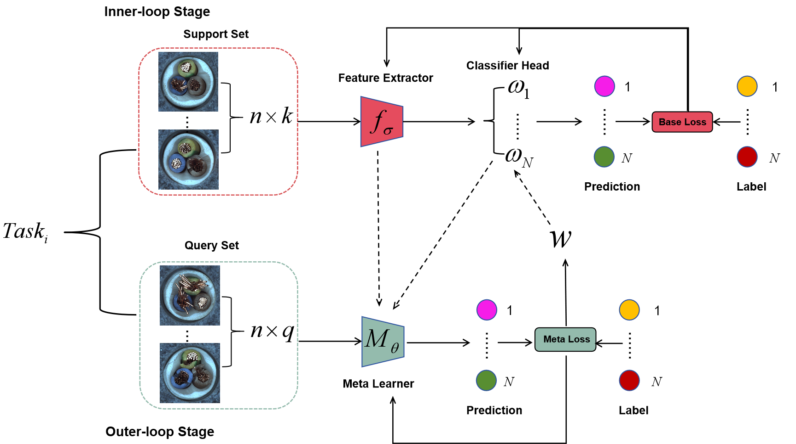

# Eternal-MAML
The code for the paper "Eternal-MAML: A Meta-Learning Framework for Cross-domain Defect Recognition".

# Requirements
- python 3.9
- pytorch 1.10.10
- cuda 12.0
# Dataset Preparation
